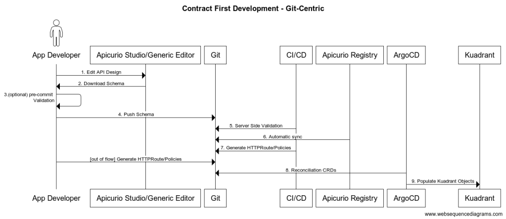

# Apicurio API Controller

## Description

The purpose of this demo is to illustrate to create a workflow that allows API design and management in Openshift.
This project includes the following components:

* [Apicurio Studio](https://github.com/apicurio/apicurio-studio), a design tool for visually creating schemas.
* [Apicurio Registry](https://github.com/apicurio/apicurio-registry), a high performance, runtime registry for API designs and schemas.
* [ArgoCD](https://github.com/argoproj/argo-cd), is a declarative, GitOps continuous delivery tool for Kubernetes.
* [Kuadrant](https://github.com/Kuadrant), an open-source project designed to provide a unified and simplified interface for managing multiple API gateways.

Any operator used in this demo must be installed using the Openshift console.

## Pre-requisites

* An available Openshift cluster must be available in the user's kubeconfig.
* Kuadrant must be installed in your cluster. Instructions to install can be found [here](https://docs.kuadrant.io/0.11.0/kuadrant-operator/doc/install/install-openshift/).
* Kuadrantctl is available locally. Instructions to install it can be found [here](https://github.com/Kuadrant/kuadrantctl?tab=readme-ov-file#installing-pre-compiled-binaries).
* oc cli is available locally.

## Installation

1. We must start by creating the Gateway that will handle the traffic for our applications. We provide one in [the deployments directory](./deployment/petstore/gateway.yaml)

2. Once the Gateway is available, we must create the namespace that will be used for this the diffent workflow components:

  `oc apply -f ./deployment/namespace/apicurio-api-controller.yaml`

3. Now we have to deploy the Apicurio components. We will start with Apicurio Registry, since Apicurio Studio will use it to store the API designs:

   * Deploy Apicurio Registry backend: `oc apply -f ./deployment/apicurio-registry/registry.yaml`
   * Deploy Apicurio Registry UI: `oc process -f ./deployment/apicurio-registry/registry-ui.yaml -p REGISTRY_API_URL="https://$(oc get route apicurio-registry -n api-controller -o jsonpath='{.spec.host}')/apis/registry/v3" | oc apply -f -`
   * Deploy Apicurio Studio UI: `oc process -f ./deployment/apicurio-studio/apicurio-studio.yaml -p APICURIO_REGISTRY_API_URL="https://$(oc get route apicurio-registry -n api-controller -o jsonpath='{.spec.host}')/apis/registry/v3" | oc apply -f -`

4. Install ArgoCD. For the full integration to work, argocd is required. It will sync the Kuadrant resources generated and apply them to the Openshift cluster. The argocd operator can be installed from the Openshift Console, just like Strimzi or Kuadrant. For convenience, we recommend installing the Red Hat OpenShift GitOps operator. This operator creates both an ArgoCD project and an ArgoCD instance that we will refer to in our application.

   * Once the ArgoCD operator has been installed, we must install the ArgoCD resources:
     * First we must create the ArgoCD role, so that the ArgoCD ServiceAccount can manage Kuadrant resources:  `oc apply -f ./deployment/argocd/cluster_role.yaml`
     * Assing the role to the ArgoCD service account: `oc apply -f ./deployment/argocd/argocd_role_binding.yaml`
     * Create ArgoCD app, changing the git repository and the directory to the values to be used by the synchronization: `oc apply -f ./deployment/argocd/argocd_app.yaml`

## Using the project.

### Pre-requisites

* This workflow assumes an existing git repository is setup in a directory `api-resources` in the project root directory. This is the same repository that must be configured in the ArgoCD application.
* Before going through the workflow, we will deploy an example application: `oc apply -f ./deployment/petstore/petstore.yaml`

### Workflow

We will discuss an example that uses the different components that have been deployed above. We must follow the steps below, that can be checked in the sequence diagram :

* *Step 1*: The API design process starts in Apicurio Studio. This is where API developers, architects, and stakeholders define the API specification using the OpenAPI (or AsyncAPI) format. Here, they specify details like:
  * API paths (endpoints)
Methods (GET, POST, etc.)
Request/response formats
Security (OAuth2, JWT, etc.)
Rate limits, request quotas, etc.

* *Step 2*: We must go to Apicurio Studio and copy the [petstore API spec](./deployment/petstore/petstore-with-rate-limit.yaml). This OpenAPI spec has a rate limit specification defined using the x-kuadrant format.

* *Step 3*: Once the API design is completed by the team, from Studio, the API can be downloaded. Once this is done, the new artifact can be added to Registry in a Gitops fashion using the existing structure in api-resources. The first version of the petstore API is already defined, we must follow the same pattern to add V2.

* *Step 4*: As an example integration, a [Python script](./scripts/artifacts_processor.py) is provided. For each artifact defined in the git structure, the Kuadrant CLI is invoked, generating the HTTPRoute, RateLimit policy and AuthPolicy (if they're defined). 

* *Step 6*: artifacts_processor.py script then stores the Kuadrant resources in the Git repository located in the directory `api-resources` and pushes the changes to the remote repo.

* *Step 7*: The git repository configured is used in a GitOps fashion, ArgoCD will take the Kuadrant resources defined in the git repository and sync them in Kuadrant.

* *Step 8*: Once the resources have been defined, the rate limits defined in the Petstore OpenAPI file are enforced. Now it's time to test it
  * Execute the following command to forward the traffic from localhost to the Istio service: ` kubectl port-forward -n gateway-system service/external-istio 9081:80`.
  * Execute `curl -H 'Host: petstore.io' http://localhost:9081/v2/dog -i`. The dog endpoint does not have any rate limit defined, so you can execute this command as many times as you want.
  * Execute `curl -H 'Host: petstore.io' http://localhost:9081/v2/cat -i`. The cat endpoint has a very aggressive rate limit policy (1req/10s), so the second time you execute the command you'll get a `429` error.

This project has been set up as an example of Kuadrant policy design and enforcement and as a potential workflow to be used in production. Just like with the rate limit policy applied to the cat endpoint, this flow can be used for any other Kuadrant resource, like authentication policies.